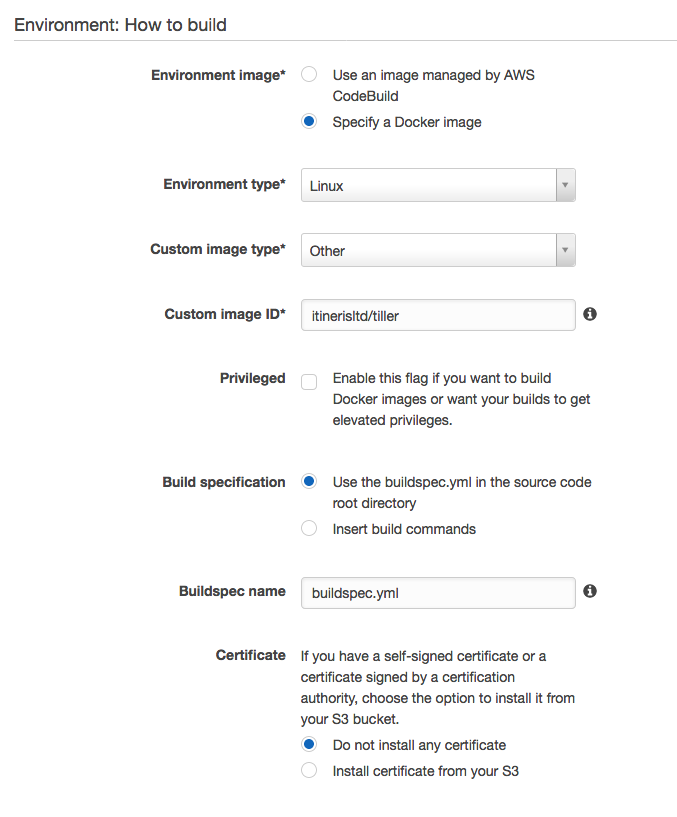
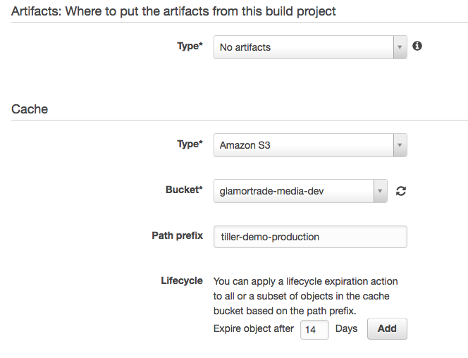
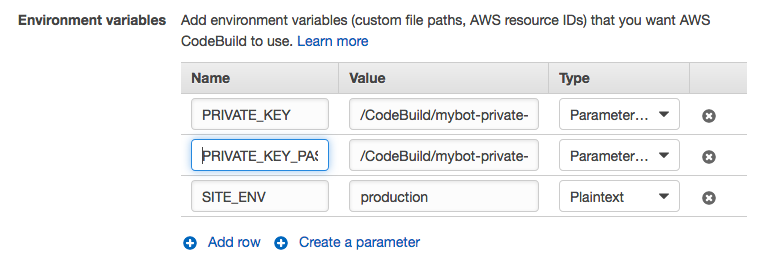

# Tiller

Deploy Trellis, Bedrock and Sage via AWS CodeBuild.

<!-- START doctoc generated TOC please keep comment here to allow auto update -->
<!-- DON'T EDIT THIS SECTION, INSTEAD RE-RUN doctoc TO UPDATE -->


- [Requirements](#requirements)
- [What's in the box?](#whats-in-the-box)
- [Set Up](#set-up)
  - [GitHub](#github)
  - [Trellis & Bedrock](#trellis--bedrock)
  - [AWS CodeBuild](#aws-codebuild)
    - [Source](#source)
    - [Environment](#environment)
    - [Artifacts & Cache](#artifacts--cache)
    - [Environment Variables](#environment-variables)
- [Author Information](#author-information)
- [Feedback](#feedback)

<!-- END doctoc generated TOC please keep comment here to allow auto update -->

## Requirements

- Trellis [b556ccd](https://github.com/roots/trellis/commit/b556ccdb2b3183eba4a9530b206a402422deeca3) or later
- Bedrock [ef090b6](https://github.com/roots/bedrock/commit/ef090b63ca0b772390a1db03cc7c118af20e8733) or later
- (Optional) Sage [9.0.1](https://github.com/roots/sage/releases/tag/9.0.1) or later
- AWS [CodeBuild](https://aws.amazon.com/codebuild/)

## What's in the box?

- [buildspec.yml](https://docs.aws.amazon.com/codebuild/latest/userguide/build-spec-ref.html) examples
- A docker image to run deployment

## Set Up

You need a robot user for deployment. In this example, we will use a GitHub machine user account as our robot. For simplicity, this robot uses the same SSH key pair to access both GitHub private repos and the web server.

### GitHub

1. Sign up a machine user on GitHub
1. Grant `mybot` **read** access to all necessary private repos
1. Generate a SSH key pair
    `ssh-keygen -t ed25519 -C "mybot-$(date)"`
1. [Upload the public key to Github](https://help.github.com/articles/adding-a-new-ssh-key-to-your-github-account/)

### Trellis & Bedrock

1. Add the SSH key to web server
    ```yml
    # group_vars/<env>/users.yml
    users:
      - name: "{{ web_user }}"
        groups:
          - "{{ web_group }}"
        keys:
          - https://github.com/human.keys
          - https://github.com/mybot.keys # <-- This line
      - name: "{{ admin_user }}"
        groups:
          - sudo
        keys:
          - https://github.com/human.keys
    ```
1. Re-provision
    `ansible-playbook server.yml -e env=<env> --tags users`
1. Copy [`buildspec.yml`](./buildspec.yml) to project root
1. Review the `buildspec.yml` file, change if needed

### AWS CodeBuild

#### Source


Link to your git repo. Use branch name as `branch filter`.

#### Environment



Use ~~`itinerisltd/tiller`~~ `tangrufus/tiller` as `custom image id`.

#### Artifacts & Cache



**Optional:** The `buildspec.yml` example caches yarn modules by default. Caching them into S3 buckets speed up the build by ~15 seconds.

#### Environment Variables




| Name                  | Value                | Type            |
| --------------------- | -------------------- | --------------- |
| PRIVATE_KEY           | /ssm/the-private-key | Parameter Store |
| PRIVATE_KEY_PASSPHASE | /ssm/the-passphase   | Parameter Store |
| SITE_ENV              | production           | Plaintext       |

## Author Information

[Tiller](https://github.com/ItinerisLtd/tiller) is a [Itineris Limited](https://www.itineris.co.uk/) project created by [Tang Rufus](https://typist.tech).

Special thanks to [the Roots team](https://roots.io/about/) whose [Trellis](https://github.com/roots/trellis) make this project possible.

Full list of contributors can be found [here](https://github.com/ItinerisLtd/tiller/graphs/contributors).

## Feedback

**Please provide feedback!** We want to make this library useful in as many projects as possible.
Please submit an [issue](https://github.com/ItinerisLtd/tiller/issues/new) and point out what you do and don't like, or fork the project and make suggestions.
**No issue is too small.**
